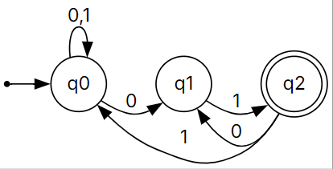
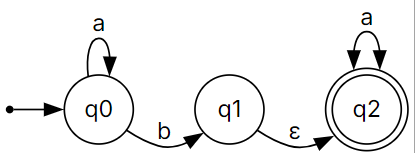

# Finite Automata Diagrams
An Obsidian plugin to render DFA (Deterministic Finite Automata) and NFA (Nondeterministic Finite Automata) diagrams directly from Markdown code blocks.

## Features
- **Simple Syntax**: Define finite automata using intuitive plaintext syntax.
- **SVG Rendering**: Diagrams are rendered as scalable vector graphics.
- **Automatic Layout**: States are automatically arranged in levels for clear visualization.
- **Dead State Detection**: Automatically identifies and highlights dead states (trap states).
- **Multi-Transition Labels**: Combine multiple transitions between the same states with comma-separated labels.
- **Error Handling**: Clear error messages for invalid syntax.

## Installation
1. Clone this repository and build the plugin
```bash
git clone https://github.com/AaryanKhClasses/obsidian-fa-plugin
cd obsidian-fa-plugin
npm install
npm run build
```
2. Copy the `manifest.json` file from root directory of the project to the generated `dist/` folder.
3. Copy the plugin folder to your Obsidian vault's `.obsidian/plugins/` directory
4. Reload Obsidian or restart the app
5. Go to Settings -> Community Plugins -> Enable "Finite Automata Diagrams"

## Usage
Create a code block with the language identifier `fa` in your Obsidian notes:
````markdown
```fa
start q0
accept q2
q0 - a -> q1
q1 - b -> q2
q2 - a -> q2
```
````

This will render a finite automaton diagram showing:
- Start state `q0` (indicated with an arrow)
- Accept/final state `q2` (shown as double circle)
- Transitions between states with their labels

## Syntax Reference
### Syntax
The FA syntax consists of three types of statements:

#### Start State
```
start <state_id>
```
Defines the initial state of the automaton. Optional, but recommended.

**Example:**
```
start q0
```

#### Accept States
```
accept <state_id> [<state_id> ...]
```
Defines one or more final/accepting states. States listed as accept states are rendered with double circles.

**Examples:**
```
accept q3
accept q2 q4 q5
```

#### Transitions
```
<from_state> - <label> -> <to_state>
```
Defines a transition from one state to another with a given label.

**Examples:**
```
q0 - a -> q1
q1 - b,c -> q2
q2 - ε -> q3
```

### State Identifiers
State identifiers can be any alphanumeric string (letters, numbers, underscores). Common conventions:
- `q0, q1, q2, ...` - numbered states
- `s0, s1, ...` - alternative numbering
- `start, middle, end` - descriptive names

### Transition Labels
Labels can include:
- Single characters: `a`, `b`, `0`, `1`
- Multiple symbols (combined): `ab`, `01`
- Special characters: `ε` (epsilon), for empty transitions
- Any text string without spaces

## Examples
### Simple Binary String Validator (ends with "01")
````markdown
```fa
start q0
accept q2
q0 - 0 -> q0
q0 - 1 -> q0
q0 - 0 -> q1
q1 - 1 -> q2
q2 - 0 -> q1
q2 - 1 -> q0
```
````


### NFA with epsilon transitions
````markdown
```fa
start q0
accept q2
q0 - a -> q0
q0 - b -> q1
q1 - ε -> q2
q2 - a -> q2
```
````


## Visualization Features
### State Levels
States are automatically arranged in horizontal levels based on their distance from the start state. This creates a left-to-right flow that's easy to follow.

### Dead States
States that only transition to themselves (trap/dead states) are automatically detected and grouped in a dashed gray box for easy identification.

### Combining Transitions
Multiple transitions between the same pair of states are automatically combined with comma-separated labels:

````markdown
```fa
q0 - a -> q1
q0 - b -> q1
```
````

renders as a single edge labeled `a,b` from `q0` to `q1`.

### Self-Loops
States can have transitions back to themselves:
````markdown
```fa
q0 - a -> q0
```
````

### Contributing
Feel free to submit issues and enhancement requests!

## License
See [LICENSE](LICENSE) file for details.

## Dependencies
- **[Obsidian API](https://docs.obsidian.md/)** - Plugin framework
- **[Viz.js](https://github.com/visvizjs/viz.js)** - Graphviz visualization in the browser

## Troubleshooting
### "Error parsing FA" message
Check that your syntax matches the required format:
- `start` statement defines the initial state
- `accept` statement(s) define final states
- Transition format: `from - label -> to` (spaces around `-` and `->` are important)

### Diagram not rendering
- Verify the code block language is set to `` `fa` ``
- Check the browser console for any errors
- Ensure all state identifiers follow alphanumeric naming rules
- Try reloading the note

## Future Enhancements
Potential improvements for future versions:
- [ ] Custom styling and themes
- [ ] Export diagrams as PNG/PDF
- [ ] Minimization algorithms
- [ ] Better support for large automata
